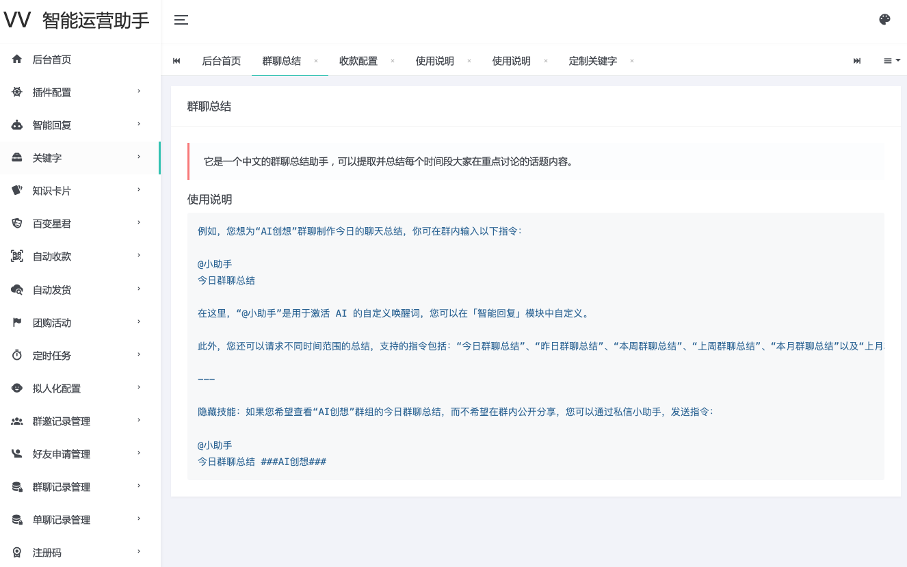

## 项目名称

vvbot 智能微信助理 - 您的高效运营伙伴。

## 亮点概览

### 1. 入群欢迎

可以为每个群组单独设置不同的欢迎信息。

### 2. 消息转发

发送至指定特殊群组的消息将自动转发至您预设的群组或好友。

### 3. 群聊保存

可以指定特定群组记录其聊天记录。

### 4. 智能回复

支持配置 Kimi AI、DeepSeek AI、智谱 AI、Dify AI、Coze AI、AI 绘画等。

### 5. 关键字

内置了群聊总结关键词，并且允许用户在后台自定义关键词，以满足您的个性化需求。

### 6. 知识卡片

一款智能知识卡片生成工具，只需提供内容，即可在私聊和群聊中快速创建卡片。

### 7. 百变星君

通过设置提示词或智能体应用，你可以自定义机器人的角色。

### 8. 自动收款

实现自动化发货和收款，您只需静待收益，无需担心域名、服务器或营业执照等问题。

### 9. 自动发货

一款高效的资源宝库查询工具，能够依据指定的关键字迅速检索出相关资源。

### 10. 团购活动

根据群成员的消息，快速汇总群成员的团购需求，自动生成商品订单列表，并支持导出 Excel 表格。

### 11. 定时任务

自定义定时任务，用户可为单聊和群组设置定时提醒，同时后台管理也支持创建群组定时任务。

### 12. 拟人化配置

支持配置 延迟回复消息、延迟同意好友请求、延迟转发消息、自定义文本分割，实现多次回复等。

### 13. 群邀记录管理

统计出群邀记录，支持导出 Excel 表格。

### 14. 好友申请管理

当收到的好友申请包含预设的申请语时，系统将自动批准并邀请该用户加入群聊，同时发送个性化私信。

### 15. 群聊记录管理

支持记录：文本、图片、表情、语音、视频、文件及公众号文章等多种消息类型。

### 16. 单聊记录管理

支持记录：文本、图片、表情、语音、视频、文件及公众号文章等多种消息类型。

## 使用说明

请选择与你的操作系统相匹配的安装包进行下载。

Windows 系统，请下载 `assets/windows/vvbot.exe`。

Mac 系统，请下载 `assets/darwin (macOS)/vvbot_Mac`。

下载软件包后，请确保为其设置执行权限，启动极为简便，仅需双击即可。 对于 Mac 用户，请在终端运行以下命令来赋予可执行权限：`chmod +x vvbot_Mac`，然后再进行双击启动。

请确保你的微信账号已开通微信支付，这样才能顺利完成扫码登录。

首次运行软件时，需要输入注册码，请添加作者微信获取：wx-xinliang。

## FAQ

如需进一步交流或获取支持，欢迎添加作者微信：wx-xinliang，也可以在付费知识星球发起提问：[https://t.zsxq.com/4lMiT](https://t.zsxq.com/4lMiT) 。

## 免责声明

- 使用本软件登录微信可能存在封号的风险，请知晓！
- 本软件用于学习研究使用，若因使用本软件造成的一切法律责任均与本人无关！